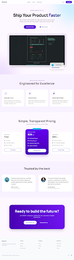

# PlanForge - Project Management SaaS

A full-stack project management application built with modern web technologies. PlanForge helps teams organize projects, manage tasks with Kanban boards, and track progress -- all from a clean, responsive interface.



## Features

### Authentication & User Management
- Secure registration and login with hashed passwords
- JWT-based session management via NextAuth.js
- User profile editing and password changes
- Protected routes with middleware

### Project Management
- Create, edit, and delete projects
- Color-coded project cards with priority badges
- Progress tracking with completion percentages
- Search and filter projects

### Kanban Task Board
- Drag-and-drop tasks between columns (To Do, In Progress, Done)
- Create, edit, and delete tasks from any column
- Priority levels (Low, Medium, High) with visual indicators
- Task assignment to team members
- Right-click context menu for quick actions

### Dashboard
- Overview statistics (total projects, task counts by status)
- High-priority task alerts
- Recent projects with progress bars
- Quick navigation to any project

### Additional Pages
- **Landing Page** - Hero section, feature highlights, pricing tiers, CTA
- **Settings** - Profile management, password change, notification preferences, theme selector

## Tech Stack

| Technology | Purpose |
|---|---|
| **Next.js 14** | React framework with App Router and Server Components |
| **TypeScript** | Type-safe development |
| **Tailwind CSS** | Utility-first styling |
| **shadcn/ui** | Accessible, composable UI components (Radix UI primitives) |
| **Prisma** | Type-safe ORM for database operations |
| **SQLite** | Zero-config embedded database |
| **NextAuth.js** | Authentication with credentials provider |
| **Zod** | Runtime schema validation |
| **Lucide React** | Icon library |

## Prerequisites

- **Node.js** 18.17 or later
- **npm** (comes with Node.js)

## Installation

1. **Clone the repository**
   ```bash
   git clone https://github.com/yourusername/planforge-saas.git
   cd planforge-saas
   ```

2. **Install dependencies**
   ```bash
   npm install
   ```

3. **Set up environment variables**
   ```bash
   cp .env.example .env
   ```
   The defaults work out of the box for local development.

4. **Initialize the database**
   ```bash
   npm run setup
   ```
   This generates the Prisma client, creates the SQLite database, and seeds it with demo data.

5. **Start the development server**
   ```bash
   npm run dev
   ```

6. **Open your browser**
   Navigate to [http://localhost:3000](http://localhost:3000)

## Demo Credentials

After seeding, you can log in with any of these accounts:

| Name | Email | Password | Role |
|---|---|---|---|
| Alice Johnson | alice@demo.com | demo1234 | Admin |
| Bob Smith | bob@demo.com | demo1234 | Member |
| Carol Davis | carol@demo.com | demo1234 | Member |

Alice owns 3 projects with realistic task data pre-populated.

## Project Structure

```
planforge-saas/
├── prisma/
│   ├── schema.prisma          # Database schema
│   └── seed.ts                # Seed data
├── src/
│   ├── app/
│   │   ├── api/               # API routes
│   │   │   ├── auth/          # NextAuth endpoint
│   │   │   ├── projects/      # Project CRUD
│   │   │   ├── register/      # User registration
│   │   │   └── user/          # User profile
│   │   ├── dashboard/         # Protected dashboard pages
│   │   │   ├── projects/      # Projects list & detail
│   │   │   └── settings/      # User settings
│   │   ├── login/             # Login page
│   │   ├── register/          # Registration page
│   │   ├── layout.tsx         # Root layout
│   │   └── page.tsx           # Landing page
│   ├── components/
│   │   ├── ui/                # shadcn/ui components
│   │   ├── dashboard-nav.tsx  # Sidebar navigation
│   │   └── providers.tsx      # Session provider
│   └── lib/
│       ├── auth.ts            # NextAuth configuration
│       ├── prisma.ts          # Prisma client singleton
│       ├── utils.ts           # Helper functions
│       └── validations.ts     # Zod schemas
├── .env.example
├── package.json
├── tailwind.config.ts
└── tsconfig.json
```

## Available Scripts

| Command | Description |
|---|---|
| `npm run dev` | Start development server |
| `npm run build` | Build for production |
| `npm run start` | Start production server |
| `npm run setup` | Initialize database with seed data |
| `npm run db:studio` | Open Prisma Studio (database GUI) |
| `npm run db:reset` | Reset database and re-seed |

## Usage Guide

### Getting Started
1. Visit the landing page and click "Get Started" or "View Demo"
2. Log in with demo credentials or register a new account
3. You will be redirected to the dashboard

### Managing Projects
1. Navigate to **Projects** from the sidebar
2. Click **New Project** to create a project with name, description, priority, and color
3. Click on a project card to view its Kanban board
4. Use the search bar to filter projects

### Using the Kanban Board
1. Open any project to see its task board
2. **Add tasks**: Click the + button on any column header
3. **Move tasks**: Drag and drop between columns, or use the dropdown menu
4. **Edit tasks**: Click the three-dot menu on any task card
5. **Delete tasks**: Use the dropdown menu on the task card

### Settings
1. Navigate to **Settings** from the sidebar
2. Update your name and email in the Profile section
3. Change your password in the Password section

## Design Decisions

- **SQLite** was chosen to make the app zero-config -- no external database server needed
- **Credentials provider** for NextAuth allows the demo to work without OAuth setup
- **Server Components** are used for data fetching on dashboard and layout pages
- **Client Components** handle interactive features (forms, drag-and-drop, dialogs)
- **Native HTML drag-and-drop** is used for the Kanban board to minimize dependencies

## License

MIT
